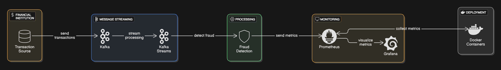
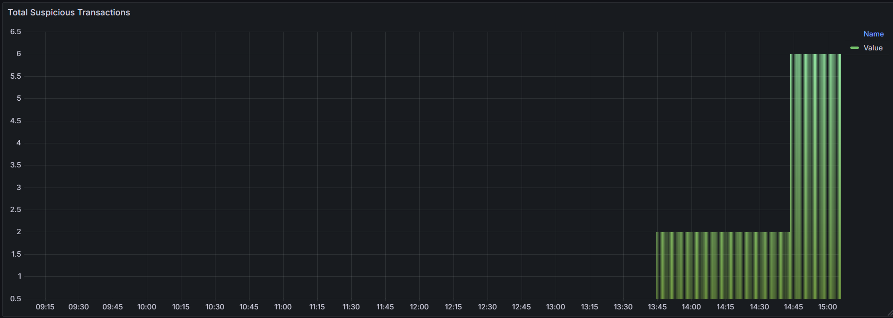

# Système de Détection de Fraudes en Temps Réel

Ce projet implémente un système de détection de fraudes en temps réel utilisant Apache Kafka Streams, Prometheus et Grafana. Le système traite les transactions financières, détecte les transactions suspectes selon des règles prédéfinies, et visualise les résultats en temps réel.

## Architecture du Système



### Règles de Détection

- Montant > 10,000: Transaction suspecte
- Métriques stockées dans Prometheus
- Alertes configurables dans Grafana

## Configuration et Déploiement

### 1. Format des données
```json
{
    "userId": "12345",
    "amount": 15000,
    "timestamp": "2024-12-04T15:00:00Z"
}
```

### 2. Structure du Projet

```
fraud-detection/
├── docker-compose.yml
├── prometheus.yml
├── pom.xml
├── src/
│   └── main/
│       ├── java/
│       │   └── com/
│       │       └── wail/
│       │           └── Main(FraudDetection).java
│       └── resources/
└── README.md
```

### 3. Configuration du Pipeline Kafka Streams

#### 3.1 Topics Kafka

`transactions-input:` Topic d'entrée des transactions
`fraud-alerts:` Topic des alertes de fraude

#### 3.2 Configuration des Topics

```bash
# Création des topics
kafka-topics --create --topic transactions-input --partitions 1 --replication-factor 1
kafka-topics --create --topic fraud-alerts --partitions 1 --replication-factor 1
```

### 4. Stockage des Transactions Suspectes
#### 4.1 Configuration de Prometheus

```yaml
global:
   scrape_interval: 15s
   evaluation_interval: 15s

scrape_configs:
   - job_name: 'fraud-detection'
     static_configs:
        - targets: ['host.docker.internal:8080']
```

### 5. Tableaux de Bord Grafana
#### 5.1 Configuration de la Source de Données

- Ajouter Prometheus comme source de données
   * URL: http://prometheus:9090
   * Access: Server

### Environnement de Déploiement
#### Docker Compose
```yaml
version: '3.8'

services:
  zookeeper:
    image: confluentinc/cp-zookeeper:latest
    container_name: zookeeper
    environment:
      ZOOKEEPER_CLIENT_PORT: 2181
    ports:
      - "2181:2181"
    networks:
      - kafka-network

  kafka:
    image: confluentinc/cp-kafka:latest
    container_name: kafka
    depends_on:
      - zookeeper
    ports:
      - "9092:9092"
    environment:
      KAFKA_BROKER_ID: 1
      KAFKA_ZOOKEEPER_CONNECT: zookeeper:2181
      KAFKA_ADVERTISED_LISTENERS: PLAINTEXT://kafka:29092,PLAINTEXT_HOST://localhost:9092
      KAFKA_LISTENER_SECURITY_PROTOCOL_MAP: PLAINTEXT:PLAINTEXT,PLAINTEXT_HOST:PLAINTEXT
      KAFKA_INTER_BROKER_LISTENER_NAME: PLAINTEXT
      KAFKA_OFFSETS_TOPIC_REPLICATION_FACTOR: 1
    networks:
      - kafka-network

  prometheus:
    image: prom/prometheus:latest
    container_name: prometheus
    ports:
      - "9090:9090"
    volumes:
      - ./prometheus.yml:/etc/prometheus/prometheus.yml
    command:
      - '--config.file=/etc/prometheus/prometheus.yml'
      - '--storage.tsdb.path=/prometheus'
      - '--web.console.libraries=/usr/share/prometheus/console_libraries'
      - '--web.console.templates=/usr/share/prometheus/consoles'
    extra_hosts:
      - "host.docker.internal:host-gateway"
    networks:
      - kafka-network

  grafana:
    image: grafana/grafana:latest
    container_name: grafana
    ports:
      - "3000:3000"
    environment:
      - GF_SECURITY_ADMIN_PASSWORD=admin
      - GF_SECURITY_ALLOW_EMBEDDING=true
      - GF_AUTH_ANONYMOUS_ENABLED=true
    depends_on:
      - prometheus
    networks:
      - kafka-network

networks:
  kafka-network:
    name: kafka-network
    driver: bridge
```
### Grafana

## Conclusion
Le système de détection de fraudes a été implémenté avec succès en utilisant:

- Kafka Streams pour le traitement en temps réel
- Prometheus pour la collecte des métriques
- Grafana pour la visualisation

Les tests démontrent que le système:

- Détecte correctement les transactions suspectes
- Stocke efficacement les métriques
- Fournit une visualisation en temps réel
- Est facilement déployable via Docker